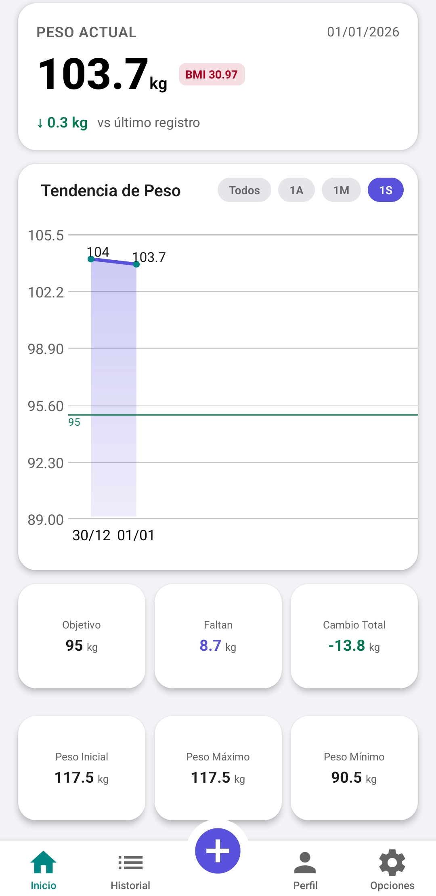
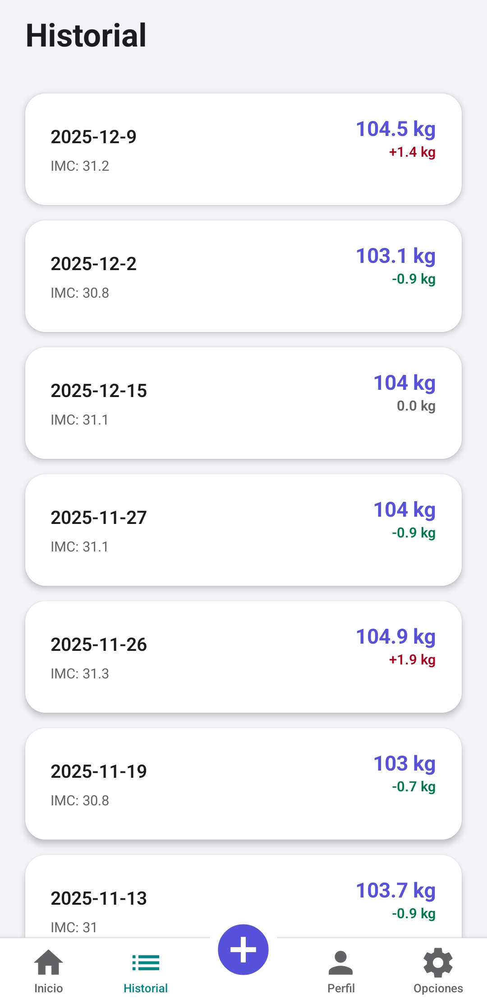
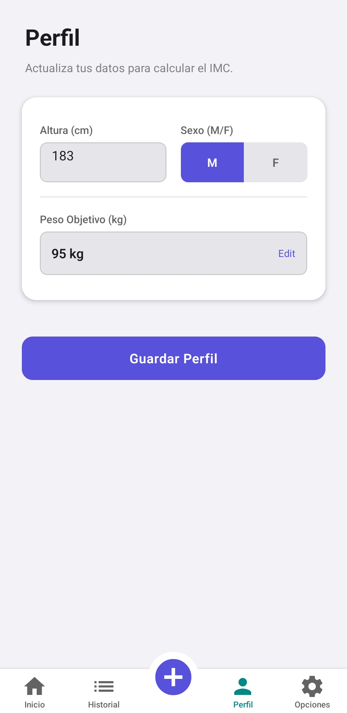
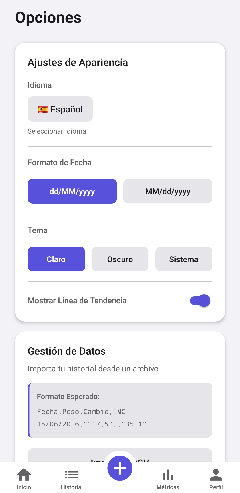

# ⚖️ Weight Tracker App

Una aplicación simple y elegante para el seguimiento de tu peso corporal, construida con React Native y Expo.

## ✨ Funcionalidades

- **Registro Diario**: Guarda tu peso y calculamos automáticamente tu IMC (Índice de Masa Corporal).
- **Visualización de Progreso**: Gráficos interactivos para ver tu evolución en el tiempo:
  - Vistas por Semana, Mes, Año o Histórico completo.
  - **Paginación Inteligente**: La vista histórica navega fluidamente a través de grandes volúmenes de datos utilizando paginación nativa sin perder precisión.
- **Estadísticas Clave**:
  - Peso Actual vs Peso Inicial.
  - Peso Máximo y Mínimo histórico.
  - Progreso total (diferencia de peso).
- **Historial Completo**:
  - Lista detallada con el historial de todos tus pesajes.
  - **Filtros Dinámicos**: Aísla registros rápidamente mediante carruseles interactivos por Año y Mes.
- **Métricas Avanzadas (Nueva Pestaña)**:
  - **Comparador de Periodos**: Visualiza variaciones absolutas y porcentuales comparando mes a mes o año a año tanto en peso como en medidas corporales.
  - **Tendencia Semanal**: Gráfico de barras inteligente para visualizar promedios semanales con colores dinámicos (verde si bajas, rojo si subes).
- **Importación de Datos**:
  - Importa tu historial existente desde archivos CSV.
  - Soporte formato robusto incluyendo fechas y valores citados.
- **Productividad y Seguridad**:
  - **Validaciones Inteligentes**: Te avisa antes de sobreescribir pesajes duplicados del mismo día y pide confirmación si intentas salir sin guardar los cambios.
  - **Atajos Rápidos (Quick Actions)**: Mantén pulsado el icono de la app desde tu pantalla de inicio para acceder directamente a "Añadir Peso".
- **Personalización**:
  - Modo Oscuro / Claro (Theme Aware).
  - Soporte multi-idioma (Español / Inglés).
  - Configuración de Peso Objetivo y Formato de Fecha.

## 📸 Capturas de Pantalla

|                              Grafico principal                              |                                 Histórico                                 |                                     Perfil                                      |                                 Opciones                                 |
| :-------------------------------------------------------------------------: | :-----------------------------------------------------------------------: | :-----------------------------------------------------------------------------: | :----------------------------------------------------------------------: |
|  |  |  |  |

_(Vistas principales de la aplicación: Inicio, Histórico Completo, Perfil y Configuración)_

## 🚀 Cómo correr la App localmente

Sigue estos pasos para ejecutar el proyecto en tu máquina:

1.  **Prerrequisitos**:

    - Tener instalado [Node.js](https://nodejs.org/) (LTS recomendado).
    - Tener instalado `git`.

2.  **Clonar el repositorio**:

    ```bash
    git clone https://github.com/jmibarra/weight-tracker-expo-app.git
    cd weight-tracker-expo-app
    ```

3.  **Instalar dependencias**:

    ```bash
    npm install
    ```

4.  **Iniciar la aplicación**:

    ```bash
    npx expo start
    ```

5.  **Ejecutar en tu dispositivo**:
    - **Físico**: Descarga la app **Expo Go** (Play Store / App Store) y escanea el código QR que muestra la terminal.
    - **Emulador**: Presiona `a` para Android o `i` para iOS (requiere configuración previa de Android Studio / Xcode).

## 📱 Descargar APK

Puedes descargar la última versión compilada (APK para Android) directamente desde la sección de **Releases** de este repositorio:

👉 [**Ir a Releases y Descargar**](https://github.com/jmibarra/weight-tracker-expo-app/releases)

---

## 🐞 Reporta un Problema

Si encuentras algún error o tienes una idea para mejorar el libro, abre un **Issue** en nuestro [tablero de Issues](https://github.com/jmibarra/weight-tracker-expo-app/issues). Por favor, incluye detalles claros y pasos para reproducir el problema si corresponde.

---

## 🤝 Contribución

¡Las contribuciones son bienvenidas! Si tienes ideas para nuevas funcionalidades, mejoras de rendimiento o correcciones de errores, me encantaría que colaboraras.

### Proceso de Colaboración (Pull Requests)

1.  **Haz un _Fork_** del repositorio.
2.  **Crea una rama** para tu funcionalidad o corrección (`git checkout -b feature/MiNuevaMejora`).
3.  **Realiza tus cambios** y haz _commit_ con un mensaje descriptivo.
4.  **Sube tu rama** a tu _fork_ (`git push origin feature/MiNuevaMejora`).
5.  **Abre un _Pull Request_** (PR) detallando los cambios que has realizado y por qué son necesarios.

---

## 📬 Comunícate

Si tienes dudas o necesitas orientación, no dudes en contactarnos a través de los Issues o mail:  
✉️ [jmibarra86@gmail.com](mailto:jmibarra86@gmail.com)

También puedes encontrarme en LinkedIn:  
🔗 [Juan Manuel Ibarra - LinkedIn](https://www.linkedin.com/in/juan-manuel-ibarra-activity/)

---

**¡Gracias por contribuir a mejorar esta herramienta!** 🌟  
Juntos podemos construir un recurso útil y abierto para la comunidad. 🙌

Si te gusta este proyecto y querés apoyar su desarrollo:

[](https://cafecito.app/jmibarradev)
